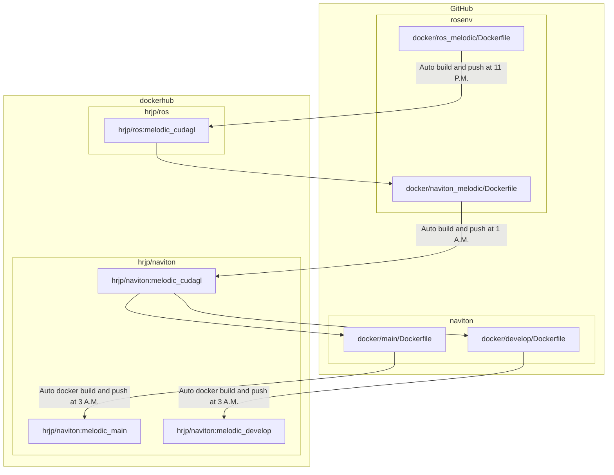

[](https://hub.docker.com/repository/docker/hrjp/naviton)
[](https://hub.docker.com/repository/docker/hrjp/ros)
[](https://hub.docker.com/repository/docker/hrjp/ros2)   


# rosenv
ROS environment construction 

---
# CI/CD Workflow
### Github repositories
* [rosenv](https://github.com/hrjp/rosenv)
* [navtion](https://github.com/hrjp/navtion)

### Dockerhub repositories

* [hrjp/ros](https://hub.docker.com/repository/docker/hrjp/ros)
* [hrjp/naviton](https://hub.docker.com/repository/docker/hrjp/naviton)





---

# Setup

```bash
git clone https://github.com/hrjp/rosenv
cd rosenv
```
ROS melodic install
```bash
./melodic_install.bash
```
Package install
```bash
./package_install.bash
```

