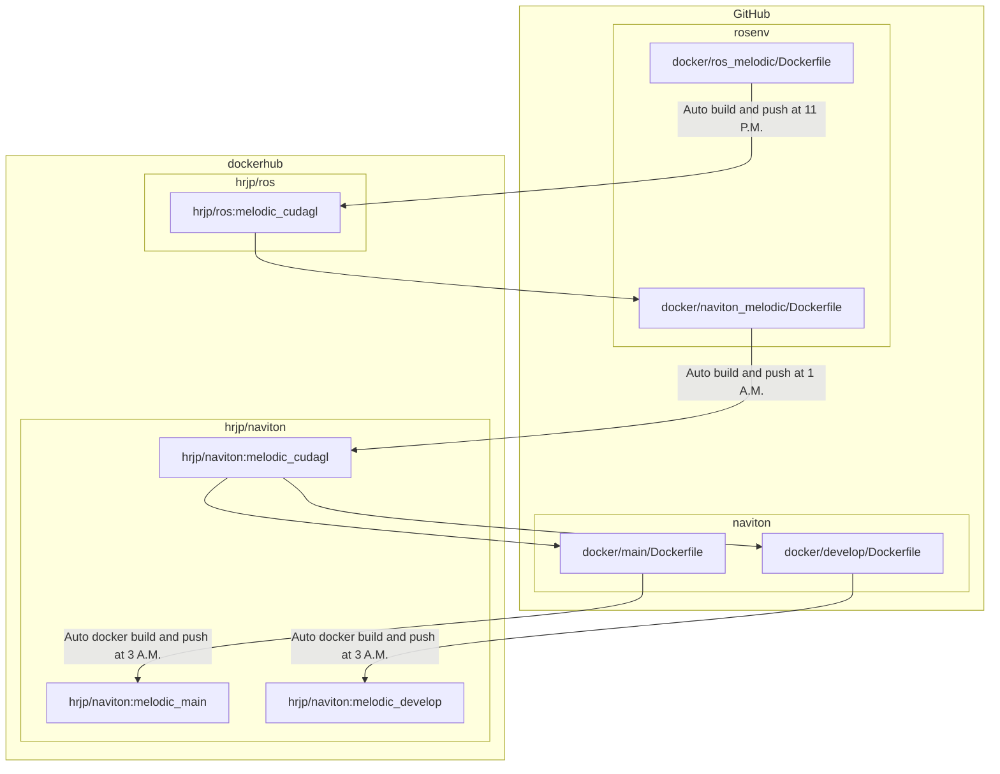

[](https://hub.docker.com/repository/docker/hrjp/naviton)   

[](https://hub.docker.com/repository/docker/hrjp/ros)
[](https://hub.docker.com/repository/docker/hrjp/ros)   

[](https://hub.docker.com/repository/docker/hrjp/ros2)
[](https://hub.docker.com/repository/docker/hrjp/ros2)
[](https://hub.docker.com/repository/docker/hrjp/ros2)   

[](https://hub.docker.com/repository/docker/hrjp/ubuntu)   

[](https://hub.docker.comUbuntu20.04/repository/docker/hrjp/yolox)   

[](https://github.com/hrjp/rosenv/actions/workflows/slam-melodic-build.yml)   


# rosenv
ROS environment construction   
ROS1/ROS2向けのDocker Image
* GPU,CUDA対応
* Ethernet,USB接続のセンサー等も使用可能
* bashスクリプトが自動生成されるのでコマンド1行でコンテナに入れる

---

# Setup

## 1. git clone
```bash
git clone https://github.com/hrjp/rosenv
```
## 2. make container
```bash
# ROS1 melodic
./rosenv/docker/ros_melodic/run.bash

# ROS1 noetic
./rosenv/docker/ros_noetic/run.bash

# ROS2 foxy
./rosenv/docker/ros2_foxy/run.bash

# ROS2 galactic
./rosenv/docker/ros2_galactic/run.bash

# ROS2 humble
./rosenv/docker/ros2_humble/run.bash

# naviton env
./rosenv/docker/naviton_melodic/run.bash

# Ubuntu 20.04
./rosenv/docker/ubuntu20/run.bash

# YOLO v5
./rosenv/docker/yolo5/run.bash

# YOLOX with ROS1 noetic
./rosenv/docker/ubuntu20/run.bash

# LeGO-LOAM and hdl_graph_slam with ROS1 melodic
./rosenv/docker/slam_melodic/run.bash
```

## container option

必要に応じて以下のオプションを指定する
| Option | Default | Details |
| :--- | :--- | :--- |
| -g | | GPUを使用する |
| -r | | コンテナからexitした際にコンテナを自動消去する | 
| -n CONTAINER_NAME | | コンテナの名前 |
| -s SHARE_FOLDER_PATH | | コンテナ内部と共有するディレクトリのパス<br>rosbagをやデータを外部と共有する際に使用<br>(ex.　shareフォルダを作ってから　/home/$USER/share ) |


### Option無しで実行 (GPU無し　コンテナ名=naviton_melodic 共有フォルダ無し)
```bash
./rosenv/docker/naviton_melodic/run.bash
```
### Optionの使用例 (GPU有り　コンテナ名=naviton　共有フォルダ=/home/$USER/share)

```bash:bash
./rosenv/docker/naviton_melodic/run.bash -g -n naviton -s /home/$USER/share
```

 ## コンテナ作成後
exitしてコンテナの外に出るとhomeディレクトリにCONTAINER_NAME.bash (CONTAINER_NAMEは自分で作成したコンテナの名前)が生成されている

```bash:bash
cd
./CONTAINER_NAME.bash
```
次回からは上記のスクリプトを実行すると自動でコンテナをスタートしてコンテナ内に入れる

---

# CI/CD Workflow
### Github repositories
* [rosenv](https://github.com/hrjp/rosenv)
* [navtion](https://github.com/hrjp/navtion)

### Dockerhub repositories

* [hrjp/ros](https://hub.docker.com/repository/docker/hrjp/ros)
* [hrjp/naviton](https://hub.docker.com/repository/docker/hrjp/naviton)




